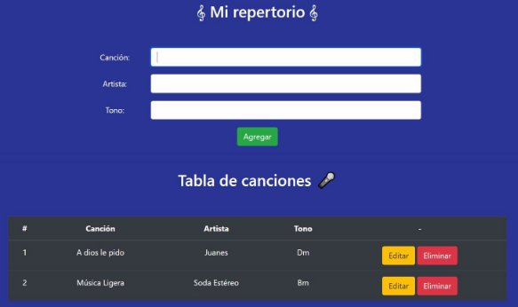

# Desafío - Mi repertorio

En este desafío deberás desarrollar un servidor con Node que utilice el paquete pg para conectarse con PostgreSQL y utilice funciones asíncronas para hacer las consultas a la base de datos.

El servidor deberá disponibilizar las siguientes rutas:

- **POST /cancion:** Recibe los datos correspondientes a una canción y realiza la inserción en la tabla **repertorio.**
- **GET /canciones:** Devuelve un JSON con los registros de la tabla **repertorio**.
- **PUT /cancion:** Recibe los datos de una canción que se desea editar y ejecuta una función asíncrona para hacer la consulta SQL y actualice ese registro de la tabla **repertorio**.
- **DELETE /cancion:** Recibe por queryString el id de una canción y realiza una consulta SQL a través de una función asíncrona para eliminarla de la base de datos.

## Comenzando 🚀

_Estas instrucciones te permitirán obtener una copia del proyecto en funcionamiento en tu máquina local para propósitos de desarrollo y pruebas._

- $ git clone https://github.com/krakerbrain/desafio_mi_repertorio
- $ cd ../path/to/the/file
- $ npm install
- $ npm i pg
- $ npm index.js

### Requerimientos

1. Crear una ruta **POST/cancion** que reciba los datos correspondientes a una canción y realice a través de una función asíncrona la inserción en la tabla **repertorio.**
1. Crear una ruta **GET /canciones** que devuelva un JSON con los registros de la tabla **repertorio**.
1. Crear una ruta **PUT /cancion** que reciba los datos de una canción que se desea editar, ejecuta una función asíncrona para hacer la consulta SQL correspondiente y actualice ese registro de la tabla **repertorio**.
1. Crear una ruta **DELETE /cancion** que reciba por queryString el id de una canción y realiza una consulta SQL a través de una función asíncrona para eliminarla de la base de datos.

##### La aplicación debe verse así:

## Construido con 🛠️

- [nodeJS](https://nodejs.org/en/)

#### Usando las librerías:

- [node-postgres](https://node-postgres.com/api/pool)
- [http](https://nodejs.org/api/http.html)
- [fileSystem](https://nodejs.org/api/fs.html)
- [url](https://nodejs.org/api/url.html)

## Autores ✒️

- **Mario Montenegro**
- **Maximiliano Paredes**
- **Eduardo Montenegro**
- **Eric Leiva**
